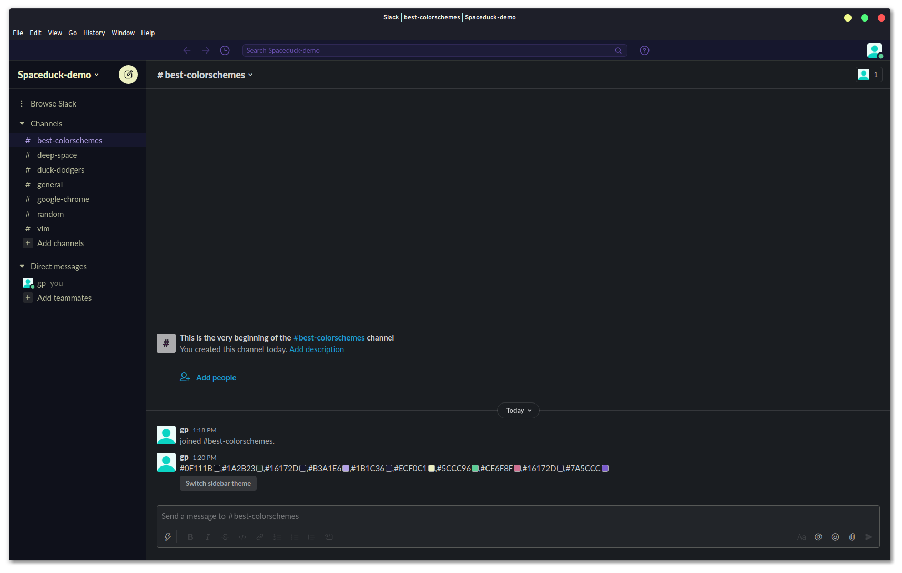
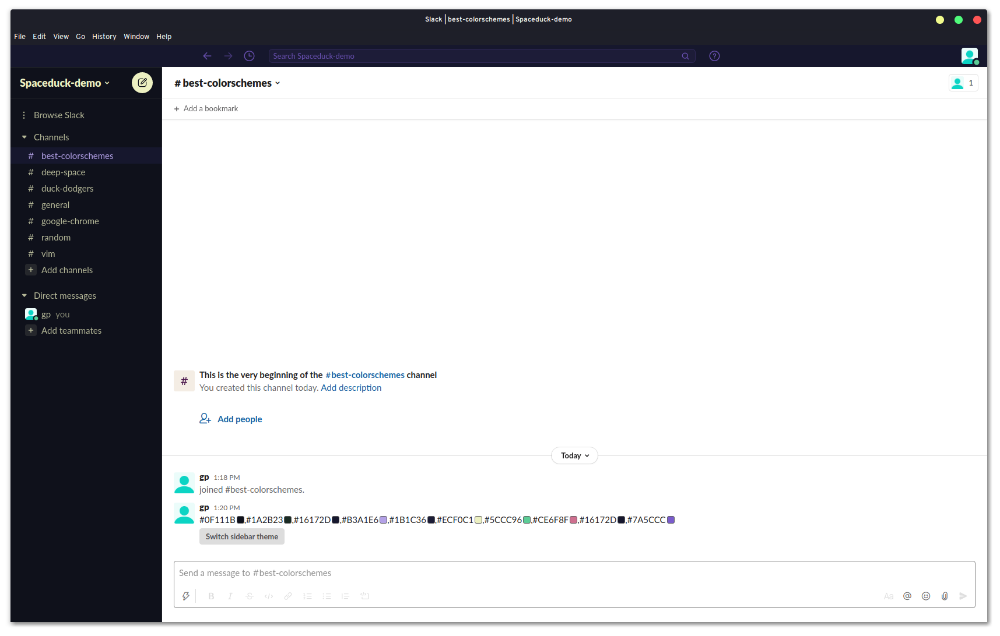
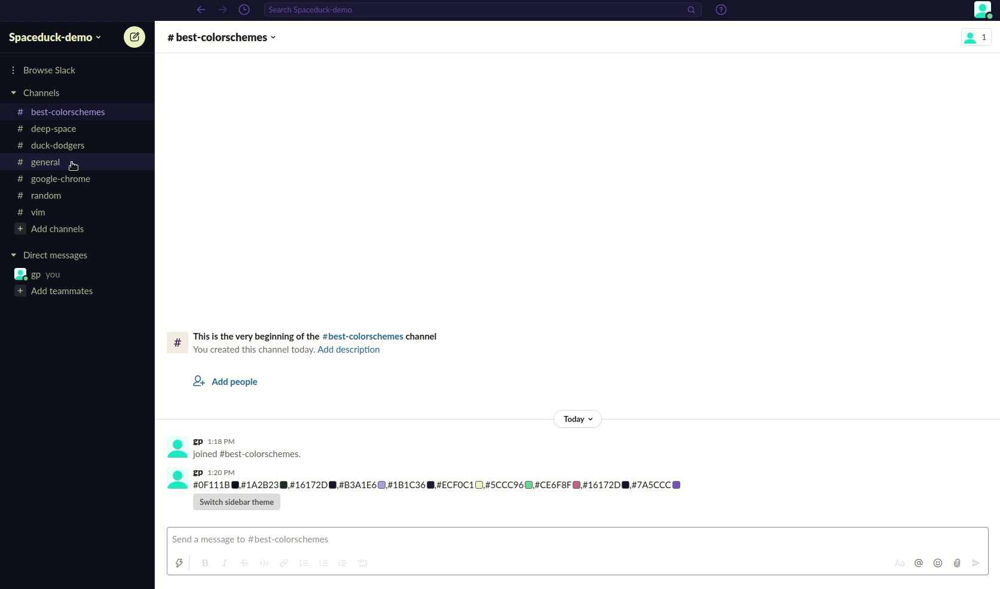
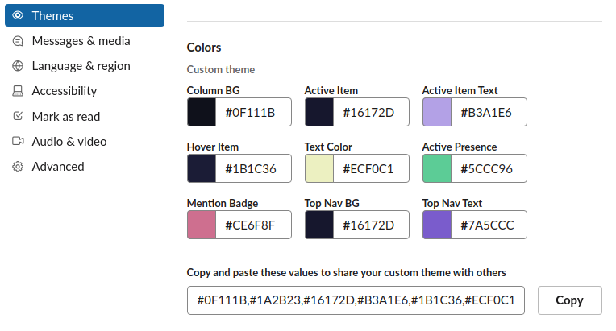

# Spaceduck for [Slack](https://slack.com/)

> A [spaceduck](https://github.com/pineapplegiant/spaceduck) theme for [Slack](https://slack.com/)



... or, using "light" mode:



---

Demo of highligh/hover coloring:



## Install

Do _**one**_ of the following methods:

1.  Copy and paste the following block:

    ```
    #0F111B,#1A2B23,#16172D,#B3A1E6,#1B1C36,#ECF0C1,#5CCC96,#CE6F8F,#16172D,#7A5CCC
    ```

    ... and paste directly into any channel/message, and then select the "Switch sidebar theme" button that appears under the message.

2. Manually update each color field in the "custom theme" section to look like so in "Prefernces --> Themes --> 'Custom theme;'":

    

3. Copy and paste the following set of values into the text input field under "Prefernces --> Themes --> 'Custom theme'":

```
#0F111B,#1A2B23,#16172D,#B3A1E6,#1B1C36,#ECF0C1,#5CCC96,#CE6F8F,#16172D,#7A5CCC
```

## License

[MIT License](./LICENSE)


